# Enterprise Problem Navigator · 企业内部问题诊断导航系统

> **Describe the problem. Get the search path. The messier the system, the more value we create.**
> **描述问题，获得路径。系统越庞杂，提效越明显。**
>
> **A diagnostic navigation system — not a knowledge base.**
> **一套问题诊断导航系统，不是一个知识库。**

---

## Why This Exists · 为什么做

**EN** | Enterprises run on fragmented knowledge. Code in one repo, configs in another workbench, SOPs in a document system, equipment logs in a third platform. When something breaks, engineers and operators manually stitch cause-and-effect chains across systems — guided by memory and "who to ask." Slow, error-prone, and impossible to scale.

**CN** | 企业的知识高度碎片化：代码在一个仓库，配置在另一个工作台，SOP 在文档系统，设备日志在第三个平台。出了问题，工程师靠记忆和"去问谁"在系统间手动拼因果链——慢、易错、无法规模化。

**We are not another knowledge base.** Knowledge bases help you *store and find* documents. We help you *diagnose and navigate* — when something breaks, where to look, in what order, with what confidence. Two different jobs.

**我们不是又一个知识库。** 知识库帮你"存和找"文档；我们帮你"查和诊"——出了问题，去哪查、按什么顺序查、每条证据有多可信。这是两种完全不同的工作。

**Our thesis · 核心假设**:

> The messier and harder-to-query the system, the more time we save. We don't exist for clean, well-documented systems. We exist for the dark knowledge — the multi-repo, multi-system, multi-year legacy that nobody fully understands anymore.
>
> 系统越庞杂、越经久难查，我们省下的时间就越多。整洁、文档齐全的系统不是我们的主战场。我们为"黑暗知识"而生——那些多仓库、多系统、多年累积、已经没人能说清楚的历史包袱。

---

## What It Does · 做什么

**EN** | A natural-language problem description in → a navigated answer out:

**CN** | 输入自然语言问题描述，输出导航式排查路径：

| # | EN | CN |
|---|----|----|
| 1 | Which objects are involved | 涉及哪些对象/实体 |
| 2 | How they relate | 它们之间什么关系 |
| 3 | What to check in what order | 按什么顺序排查 |
| 4 | How confident each piece of evidence is | 每条证据的可信度几何 |

**EN** | The system never executes changes automatically. It navigates. Humans decide.

**CN** | 系统从不自动执行变更。它导航，人做决策。

---

## Architecture · 架构

### One Core, Connect to Any Enterprise System · 一个内核，连接任意企业系统

**EN** | The core knows only "entity + relationship + connector interface." It doesn't know what company or industry it's serving. A connector pack registers its system-specific types and rules — zero core modifications. This is **one enterprise solution**, not a vertical industry play.

**CN** | 内核只认"实体 + 关系 + 连接器接口"，不关心它服务的是哪家公司、哪个行业。连接包注册自己的系统类型和规则——内核零改动。这是**一个企业级解决方案**，不是一个垂直行业方案。

---

## V1: Financial R&D Pack · 金融研发包 (Shipping)

| Area · 领域 | Detail · 详情 |
|---|---|
| **Knowledge sources · 知识源** | Code repos, config workbenches, service directories / 代码仓库、配置工作台、服务目录 |
| **Core entities · 核心实体** | Repository, SourceFile, CodeSymbol, ApiEndpoint, ConfigItem, ErrorCode, Task |
| **Evidence system · 证据体系** | 4-level confidence: `Source Code` → `Config` → `Derived` → `LLM Speculation` / 4 档可信度：`源码` → `配置` → `推算` → `推测` |
| **Hallucination guards · 防幻觉** | Every claim requires a verifiable source reference; speculation is explicitly labeled / 每条断言必须有可验证的引用来源；推测明示标注 |
| **Validation · 验证** | Validated on a synthetic sandbox mirroring real-world incident patterns. Being adopted internally (confidential). / 在模拟真实场景的合成沙盒上验证通过，正在公司内部落地（细节保密）。 |

**Demo Preview · 演示预览** (video coming soon · 视频即将上线):

| Problem · 问题 | Navigation Output · 输出路径 |
|---|---|
| "Credit API keeps returning 500" | Chain: Gateway → Service → DB → Config → Cache. Evidence per hop. |
| "New config not taking effect across all instances" | Config scope → rollout status → instance health check order |
| "Cross-repo dependency breaking after upgrade" | Dependency graph → affected modules → recommended rollback order |

---

## V2 (Planned): Pharma Pack · 药企包

- **Connectors · 连接器**: LIMS/ELN, CTMS/EDC, regulatory document PDFs (NMPA/FDA), pharmacovigilance databases, patent/literature sources
- **Entities · 实体**: Compound, Drug, Indication, ClinicalTrial, Subject, SOP/BatchRecord, AdverseEvent, RegulatoryClause
- **Diagnostic rules · 诊断规则**: Adverse-event signal tracing, regulatory applicability, change-impact chain analysis / 不良反应信号溯源、法规适用性判断、变更影响链分析
- **Partnership · 合作**: Collaborating with pharma SMEs via Chengdu Tianfu International Bio-Town / 通过成都天府国际生物城与药学 SME 共建

---

## Progress Log · 进度日志 (Build in Public)

| Date · 日期 | Milestone · 里程碑 | Status · 状态 |
|---|---|---|
| 2026-08-05 | Core architecture finalized; repo launched / 核心架构确定，仓库上线 | ✅ |
| 2026-08-05 | BUIDL_QUESTS 2026 submission (Track: OPC) | ✅ |
| — | V1 Financial R&D pack MVP (synthetic sandbox) / 金融研发包 MVP | 🔄 In progress |
| — | Demo video (2 min) / 2 分钟演示视频 | 📅 Planned |
| — | Connector SDK first draft / 连接器 SDK 初版 | 📅 This month |
| — | V2 Pharma pack kickoff / 药企包启动 | 📅 Q4 2026 |

---

## Built By · 关于作者

**EN** | A solo developer on the One-Person-Company model. One founder + agents + pluggable connector packs = an enterprise solution that scales from one company's internal systems to many.

**CN** | 一人公司模式。一个创始人 + 智能体 + 可插拔连接包 = 从一个公司内部系统扩展到更多企业的企业级解决方案。

---

## Links · 链接

- [BUIDL_QUESTS 2026 Event Page](https://openarena.to/en/events/buidl-quests-2026)
- [Product Overview (Chinese) · 产品泛化方案](docs/product-overview.md)

---

*This project is submitted to BUIDL_QUESTS 2026 — Track: OPC / Super Individuals.*
*本项目提交至 BUIDL_QUESTS 2026 — 赛道：OPC / 超级个体。*